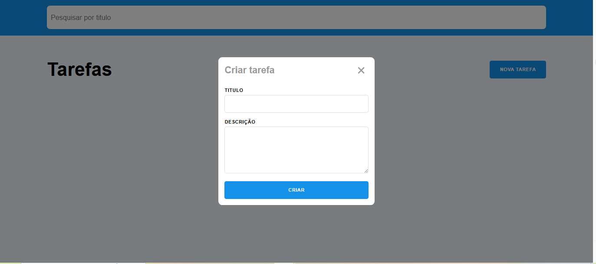

# Mini Projeto - Lista de Tarefas

Projeto desenvolvido em aula.

Permite criar, listar, pesquisar e excluir tarefas, utilizando uma API local.

---

## 📌 Funcionalidades

- Criar novas tarefas
- Listar tarefas
- Pesquisar por título ou descrição
- Excluir tarefas
- Exibir mensagem quando nenhuma tarefa é encontrada

## 👩🏽‍💻 Autora Jéssica Gonçalves

